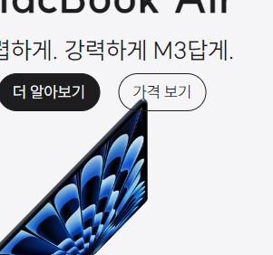

# apple 제품 카드 과제

🍎 [**apple 과제 바로가기 링크**](https://yzz2y.github.io/homework/apple/apple.html)

<br />

## 목차

1. **[코드 설명](#코드-설명)**
1. **[결과 화면](#결과-화면)**
1. **[문제점](#문제점)**
1. **[회고](#회고)**

<br />

## 코드 설명

### 마크업

> 카드 컴포넌트

반응형 쿼리나 전체적인 레이아웃을 생각해보기에 앞서 카드 컴포넌트를 가장 먼저 설계했다.

각 카드 컴포넌트는 개별적인 아이템이므로 `article`로 감쌌다.

각 `article`은 배경 이미지로 처리할 `div`와 제목, 부제목, 버튼을 감싸는 `div`, 총 2개의 컨테이너로 구성했다.

간격 스타일링에 용이하도록 {제목, 부제목}, {버튼 (2개)}으로 다시 나누어 감쌌다.

<br />

> 전체 레이아웃

`h1`을 사용하여 페이지의 제목을 작성했다. 시안에는 해당 내용이 없으므로 `sr-only`를 사용하여 숨김처리했다. 보이지 않지만 페이지의 머릿말을 담당하므로 `header`로 감쌌다.

구현하고자 하는 페이지가 제품들을 쭉 나열한 형태이므로 `ul` 요소에 담아보았다. 이후 그리드 스타일링을 위해 2 X 2 그리드 형태를 갖출 `li`들과 그렇지 않은 `li`들을 각기 다른 `ul`에 담았다.

앞서 `h1`을 `header`로 감쌌으므로 구색을 맞추고자 두 `ul`을 `main`으로 감쌌다.

<br />

> 네이밍

기본적으로 **BEM 방식**을 택했으며 (중첩이 깊은) 세부적인 요소는 요소가 담고 있는 내용을 바로 알 수 있도록 네이밍했다.

<br />

### 스타일링

> 카드 컴포넌트

`min-width`를 사용한 **미디어 쿼리**를 통해 **모바일 퍼스트** 방식으로 스타일링했다. 공통 또는 작은 화면에만 적용될 스타일링을 우선적으로 작성한 후 큰 화면에만 적용될 스타일링을 작성했다.

카드 컴포넌트를 감싸는 가장 큰 컨테이너의 `position`값을 `relative`로 설정, {제목, 부제목, 버튼}을 담은 컨테이너에 `absolute` 값을 주어 이미지 위에 배치될 수 있도록 했다.

{제목, 부제목, 버튼} 컨테이너를 `flex` 컨테이너로 만들고 `column` 방향으로 배치하였다.

{제목, 부제목} 컨테이너와 {버튼} 컨테이너도 마찬가지로 각각 `flex` 컨테이너로 만들었다. {제목, 부제목} 컨테이너는 `column` 방향으로, {버튼} 컨테이너는 `row` 방향으로 배치했다.

부제목의 경우 작은 화면에서는 줄바꿈이 되도록, 큰 화면에서는 한 줄에 배치되도록 해야하므로 (여러 줄인 경우) `flex` 컨테이너로 감싸서 작은 화면일 때는 `column`으로, 큰 화면일 때는 `row`로 배치했다. [(문제점)](#줄바꿈)

<br />

> 카드 이미지

원래 카드 이미지 배정을 카드 컴포넌트 안에 넣었으나 길이가 너무 길고 중첩이 깊어져서 밖으로 뺐다.

`background-image` 속성으로 각 컴포넌트 별 이미지를 배경처리 했다.

픽셀 밀도에 따라 각기 다른 해상도의 이미지를 불러오는 방법으로는 `srcset`이 있지만, `img` 태그를 사용하지 않고 배경처리했기에 `image-set` 속성값을 사용했다.

```css
.ipad-pro .product__image {
  background-image: image-set(
    url(./../products/ipad_pro.jpeg) 1x,
    url(./../products/ipad_pro_2x.jpeg) 2x
  );
}
```

큰 화면에서는 wide 이미지를 불러와야 하는 요소들에만 따로 미디어 쿼리 안에서 `image-set` 속성값을 사용했다.

<br />

> 전체 레이아웃

2 X 2에 포함되지 않는 `li`들은 1열짜리 `grid`로, 포함되는 `li`들은 작은 화면에서는 1열짜리, 큰 화면에서는 2열짜리 `grid`가 되도록 미디어 쿼리를 사용하여 스타일링했다.

<br />

> 홀수/짝수번째 스타일링

시안을 보면 홀수번째와 짝수번째 카드 컴포넌트의 스타일링(_제목과 부제목 글씨 색깔, 버튼 색깔_)이 다르다.

이를 위해 `html`파일에서 각 `li`에 odd, even `class`를 지정하여 따로 스타일링했다.

원래 전체 레이아웃을 한 개의 `ul`로 묶고 `nth-child`를 사용하는 식으로 홀수/짝수번째 요소를 지정해야할까 생각했으나 한 개의 `ul`로 2 x 2 그리드 스타일링을 어떻게 해야할 지 감이 잘 안오기도 했고, 추후 그리드에 추가할 아이템이 늘어나면 2 X 2 그리드 아이템들을 별개의 `ul`에 담는 것이 좋지 않을까 생각하여 다소 번거로운 홀수/짝수 스타일링을 해버렸다.

<br />

## 결과 화면

<video src="https://github.com/user-attachments/assets/75ef9022-5675-4c64-a88a-19a93875baa9" width="600" height="340" controls></video>

<br />

## 문제점

### 중첩 깊이

이번 과제의 `css`를 작성하면서 가장 머리 아팠던 부분이다.

클래스 안의 클래스가 가리키는 요소를 스타일링할 때 중첩된 클래스를 다 쓰자니 중첩이 너무 깊어지고, 그렇다고 수정을 하니 화면 상에서 결과 반영이 갑자기 안되는 등 여러 우여곡절을 겪었다.

### 줄바꿈

제공받은 `theme.css`에 부제목 줄간격을 위한 `--line-normal` 변수가 있었기 때문에 줄바꿈되는 텍스트가 같은 요소에 들어가야할 것으로 보인다.

그런데 같은 요소에 들어있는 텍스트를 화면 크기에 따라 줄바꿈 여부를 바꾸는 방법을 도저히 모르겠어서 어쩔 수 없이 `flex` 컨테이너를 사용한 보여주기식 마크업/스타일링을 했다.

같은 `span` 요소에 넣고 중간에 `br`로 줄바꿈을 한 후 브라우저 창이 커지면 `br`의 `display`를 `none`으로도 해봤다가 너무 미련해보여서(,,^^) 그냥 `flex`로 구현했다. 슬비쌤의 해설이 너무 궁금하다 ❗❗

### 여백

내 결과 화면을 보면 큰 화면에서 맥북 에어 컴포넌트의 이미지와 버튼이 겹치는 것을 관찰할 수 있다.



사실 맥북 에어뿐만 아니라 다른 컴포넌트들도 제목 위 여백이 제대로 적용되지 않은 듯(너무 내려온 것 같음) 보이는데 어째서인지 이유를 모르겠다.😢

<br />

## 회고

과제를 시작한 지 얼마 되지 않았을 때는 의외로 할만하다고 생각했는데 ~~응 역시~~ 아니었다.<br />
마크업이나 스타일링 자체가 어려운 것 같진 않은데 코드를 다 짜고 보니 중복도 많고 중첩도 깊고 미련한 스타일링도 많은 것 같아 아직 멀었구나 싶었다.

그래도 직접 페이지를 구현해보니 확실히 익숙해지는 듯했다. 수업을 들을 땐 당연히 할 수 있을 것이라 생각했던 부분에서 막히기도 하고, 컴포넌트 단위로 조립하듯이 설계하는 과정을 거치면서 이런 경험이 계속 쌓여가면 의미있는 성장을 할 수 있겠구나 생각했다.
