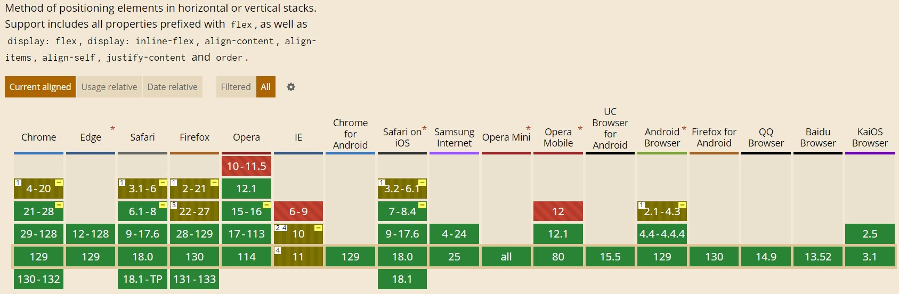
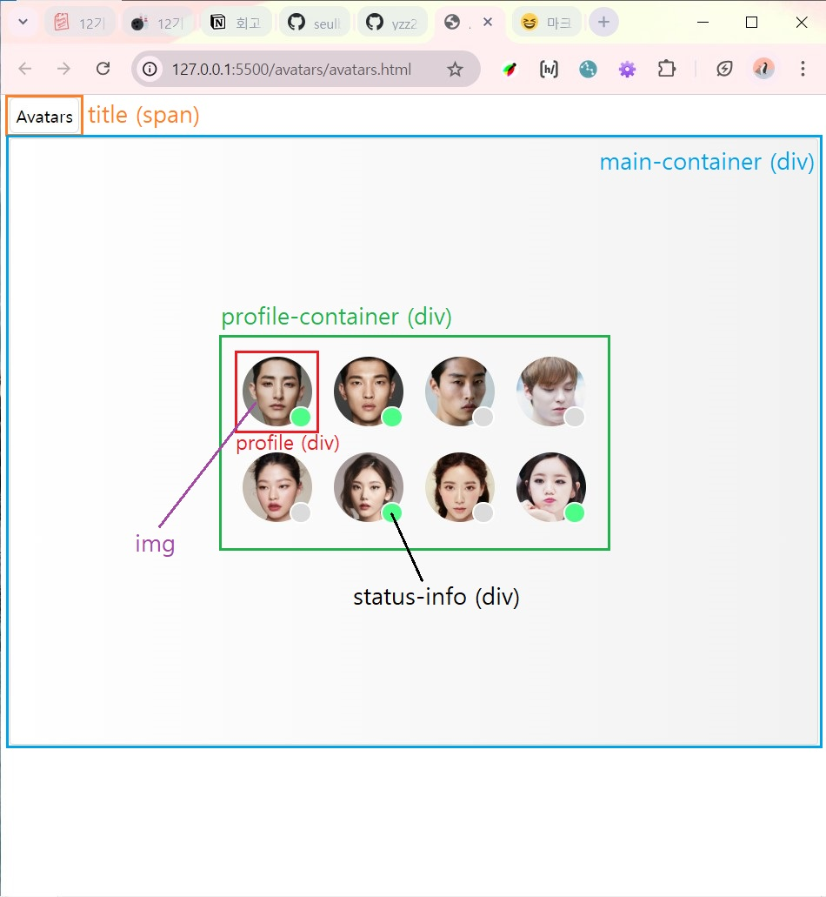
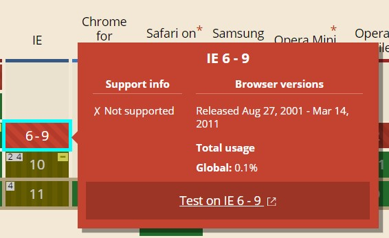
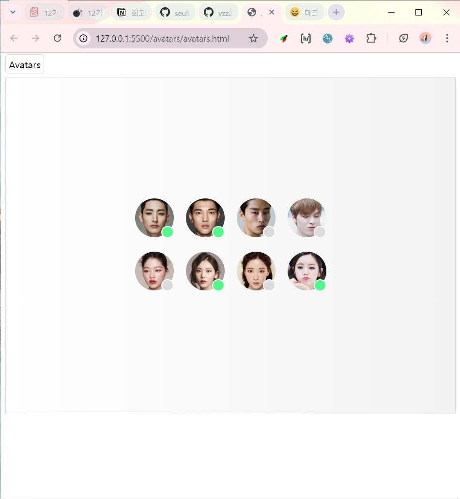
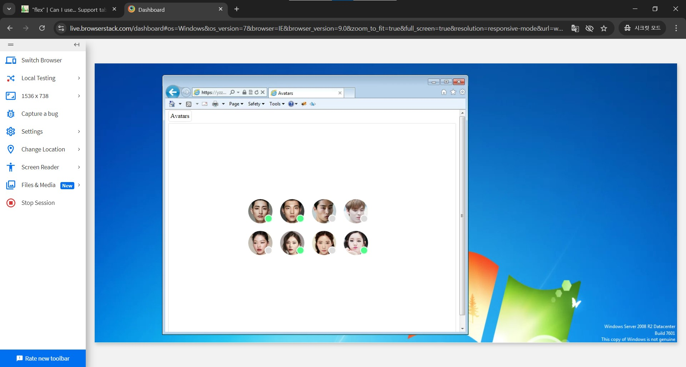
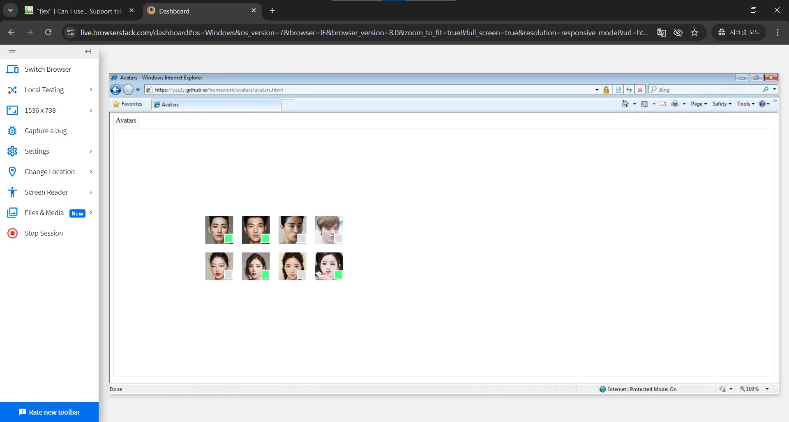

# Avatars 과제

## 목차

1. [과제 준비](#과제-준비)
1. [코드 주요 설명](#코드-주요-설명)
1. [결과 화면](#결과-화면)
1. [과제 조건 확인](#과제-조건-확인)
1. [결론 및 문제점](#결론-및-문제점)

<br />

## 과제 준비

주어진 과제는 크게 **두 가지** 였다. <br />

> 1. `float`를 사용하여 다음의 레이아웃을 구현해 본다.
> 1. `flex`를 지원하는 환경에서는 다음과 같이 배치되도록 레이아웃을 구현해 본다.

여기서 **`flex`를 지원하는 환경**이 무슨 말인지 생각해보던 중 [**caniuse**](https://caniuse.com/) 사이트가 떠올랐다.


`flex`를 지원하지 않는 일부 브라우저가 존재하기 때문에 이를 고려하여

> 1. 지원하지 않는 브라우저 -> `float` 사용
> 1. 지원하는 브라우저 -> `flex` 사용

이런 방식으로 구현하라는 뜻으로 해석했다.

2개의 css 코드 (float를 사용한 css 코드와 flex를 사용한 css 코드)로 구현해야하나 했는데 구글링을 하다가 css에 특정 기능을 지원하지 않는 브라우저를 위한 `@supports`라는 조건문이 있다는 것을 알게 되었다.

기본 보여주기 값을 float를 사용한 레이아웃으로 해놓고 `@supports` 조건문을 통해 flex를 지원하는 환경에서는 flex를 사용한 레이아웃을 보여주도록 구현해보기로 했다.

<br />

## 코드 주요 설명



### title

> 'Avatars' 문구를 `span`으로 구현

### main-container

> - profile-container를 감싸는 전체 배경을 `div`로 구현
> - **Flex 지원 환경**
>   > - 안에 profile-container를 가운데로 오게 하기 위해 **flex 컨테이너**로 구현하여 `justify-content`와 `align-items`를 모두 center로 지정

### profile-container

> - 총 8개의 profile을 감싸는 큰 컨테이너를 `div`로 구현
> - **Flex 지원 환경**
>   > - 안에 profile들이 주어진 간격을 갖고 나열되도록 **flex 컨테이너**로 구현
>   > - 각 줄에 4개씩 배열되도록 적절한 width를 지정한 후 `wrap` 설정을 주어 5개째부터는 다음줄로 넘어가도록 구현
>   > - 이를 `grid`로 구현할까 고민했으나 `flex`를 지원하는 브라우저가 반드시 `grid`도 지원한다는 보장이 없다고 생각하여 그냥 `flex`로 구현함 (아직 잘 모르겠음)

### profile

> - 각 프로필 이미지와 활동 상태를 표시하는 동그라미(status-info)를 감싸는 작은 컨테이너를 `div`로 구현
> - 활동 상태 동그라미의 위치 배열을 위해`relative`로 설정
> - **Flex 지원 환경**
>   > - `@supports` 밖에 설정해놓은 `float`와 margin 값을 없앰

#### img

> 프로필 이미지를 `img` 태그를 사용하여 첨부

#### status-info

> - 활동 상태인 동그라미의 class를 online, 비활동 상태를 offline이라 명명
> - `img` 위에 올라와 우측 하단에 위치할 수 있도록 `absolute`로 설정한 후 right, bottom 간격을 지정함

<br />

## 결과 화면


[**caniuse**](https://caniuse.com/) 사이트에서 여러 브라우저로 테스트할 수 있길래 flex를 지원하지 않는 브라우저중 하나인 Internet Explorer 9에 내가 배포한 github 페이지 주소를 주소창에 입력하여 접속해보았다.

<br />




첫 번째 이미지는 내가 현재 사용하는 **Chrome129**에서의 결과(`flex` 지원 환경)를, 두번째 이미지는 [**caniuse**](https://caniuse.com/) 사이트를 이용하여 테스트한 **IE9**에서의 결과(`flex` 미지원 환경)를 각각 캡쳐한 것이다.

<br />

## 과제 조건 확인

- [x] 아바타 이미지는 배경 방식이 아닌 콘텐츠 이미지(\ 요소)로 마크업한다. <br/>
- [x] 이미지 `성능 최적화` 방법에 대해 고민해본다. <br/>
  > 이미지 성능 최적화를 위해 강의 시간에 배운 `지연 로딩`을 각 img 태그에 적용함

```

```

- [x] 아바타의 `상태 정보`를 알 수 있도록 정보를 제공한다. <br/>
  > 각 아바타 이미지 우측 하단에 상태 정보를 알리는 동그라미 div 구현
- [x] 아바타 이미지의 크기 - 64px X 64px <br/>

```
img {
  width: 64px;
  height: 64px;
  border-radius: 50%;
}
```

- [x] 아바타 이미지 간의 간격 - 20px <br/>
  > 아바타 이미지들을 감싸는 div에 gap을 지정

```
.profile-container {
  display: flex;
  flex-wrap: wrap;
  gap: 20px;
  width: 316px;
}
```

- [x] 회색 원 배경색 - #DBDBDB <br/>

```
.offline {
  background-color: #dbdbdb;
}
```

- [x] 초록색 원 배경색- #4CFE88 <br/>

```
.online {
  background-color: #4cfe88;
}
```

<br />

## 결론 및 문제점

`flex`를 지원하는 환경과 그렇지 못한 구 브라우저(IE9)에서 원하는 대로 렌더링 된 결과를 확인했다.

다만 `float`와 `flex`의 개념이 익숙치 않고, 특히 `@supports` 조건문의 개념을 처음 알아서 이들을 제대로 사용한 것인지 의문이다.

사실 IE8에서도 테스트를 해보았는데 어째서인지 프로필 이미지들이 전부 다음과 같이 네모네모로 보였다.



그리고 주어진 과제에서는 `float`와 `flex`에서의 프로필 이미지 배열 순서가 서로 다른데 어떻게 하는지 잘 모르겠어서 하나로 통일했다(...)
