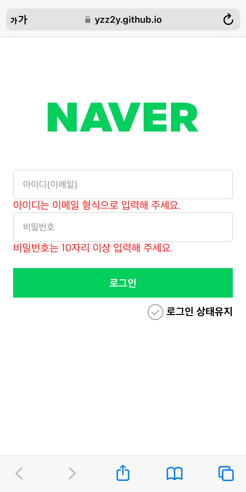
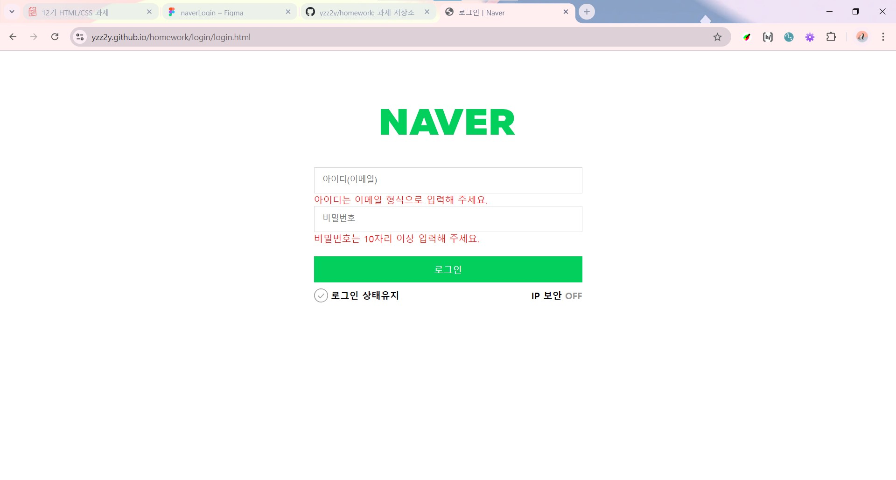

# Avatars 과제

## 목차

1. [코드 설명](#코드-설명)
1. [결과 화면](#결과-화면)
1. [과제 조건 확인](#과제-조건-확인)
1. [결론 및 문제점](#결론-및-문제점)
1. [회고](#회고)

 

## 코드 설명

 

## 결과 화면

 

## 과제 조건 확인

 

## 결론 및 문제점

주어진 이미지에 얼추 맞는 형태는 구현했다.

하지만 시간이 부족하여 가장 중요한 요소 중 하나인 `웹 접근성`을 고려한 마크업을 수행하지 못했다.

또, 유효하지 않은 입력값에 대한 경고 메세지를 로그인 버튼을 누른 후에 검사한 후 표시되는 것이 목적인 것 같으나 페이지가 로드될 때부터 표시되어있다.
 
이를 위해 나름대로 정보를 찾아보았으나 아직 해결하지 못하였다.

 

## 회고

시간에 쫓기느라 짜임새있는 마크업과 효율적인 스타일링을 하지 못한 것이 매우 아쉽다.

독학할 때는 슬비쌤 말씀대로 `html`이 이렇게 어려운지 몰랐던 것 같다. 본격적인 스타일링에 들어가기에 앞서 구조를 짜는 것부터 내 예상을 벗어난 만큼의 시간을 써버렸다.

마크업한 모든 태그에 `class`를 지정해줘야 하는 건지, 아니라면 어떤 식으로 `class`를 지정하는 것이 효율적인지 아직도 감이 제대로 안잡힌다.

`div`를 최대한 쓰고 싶지 않은데도 불구하고 결국 `div` 범벅인 마크업을 하면서 어떻게 바로 잡아야 하는건지 혼란스러웠다.

부트캠프를 들으며 프론트엔드 개발자의 역할이 그저 보이는 것에만 집중하는 것이 아니라는 사실을 깨달았고 나도 그러지 않기 위해 노력하고 있으나, 이번 과제에서도 보이는 것에만 집중한 마크업을 짠 것 같다.

다음부터는 충분한 시간을 두고 천천히 고민하며 과제를 수행하고 싶다.
